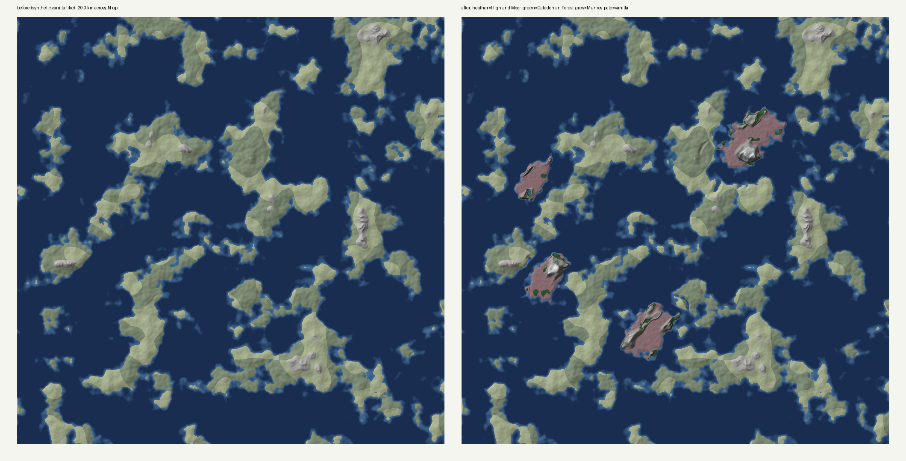
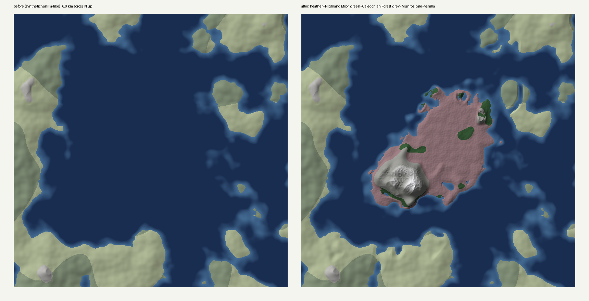
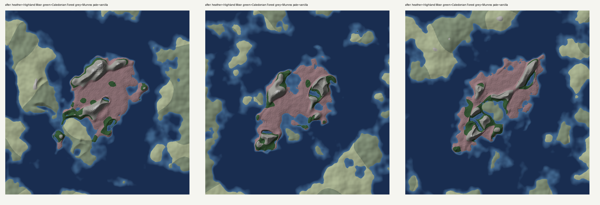
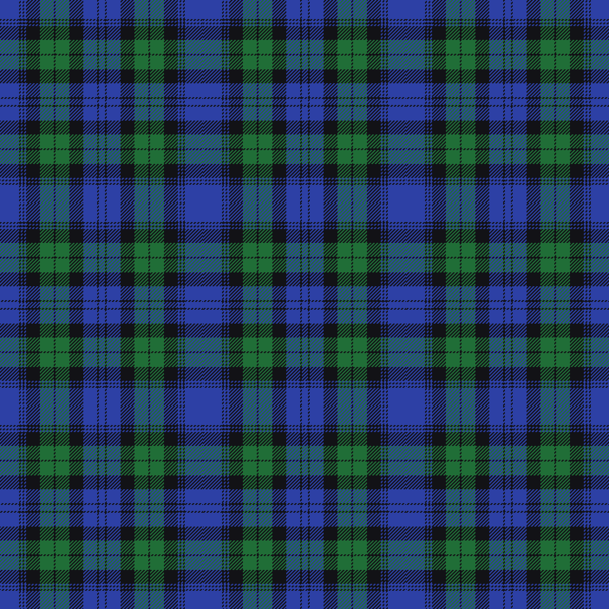

# Scotheim

A BepInEx mod for Valheim that adds Scottish Highlands islands: new land raised out of open ocean (four islands by default), with three biomes of their own and Mistlands-tier creatures from Highland wildlife and folklore. Vanilla land isn't touched.





*A synthetic, vanilla-like world (6 km across, north up) before and after. This is not a real seed; see [Status](#status).*



## The three biomes

| Biome | Where | Terrain | Vegetation | Weather |
|---|---|---|---|---|
| **Highland Moor** | The open lowland shelf (median slope ~4°) | Rolling relief, hummocks, lochans | Heath shrubs, blaeberries, birch copses, erratic boulders, rare standing stones | Mostly heath-clear and mist, some drizzle |
| **Caledonian Forest** | A fringe around the hills, glens through them, a few patches on the moor | Drumlins aligned NE–SW, hummocky moraine | Open Scots pine with birch, blaeberry and raspberry; no spruce; rare ruined shielings | Forest mist, some rain |
| **Munros** | The hill massifs, above ~32 m of base height | Rounded domes, NE-facing corries, soft-capped summits | Crags and scree; a few stunted pines and birches below ~70 m; rare cloudberries on high ground | Freezing snow and storms, with misty breaks |

Each biome borrows a vanilla height function and ground texture. The moor uses Meadows' grass, plus meadow grass, heath flowers and bracken as ground clutter. EWD's `nature` setting only affects farming, bees and footsteps: the Moor farms like the Plains (barley, flax), the forest like the Black Forest. Vegetation comes entirely from `expand_vegetation_scotheim.yaml`, so no vanilla plants leak in. There are no ores yet.

The landscape between them:

- **Glens** are U-shaped troughs trending NE–SW, the Great Glen / Caledonian grain at about 040°. Each glen widens with its depth so walls stay near 35°.
- **Ribbon lochs** form where glen floors drop below sea level.
- **Sea lochs** form where glens reach the coast.
- The island is an ellipse along the grain, 4 × 2.3 km by default, with a ragged coast. Most of it is a flat lowland shelf (~14 m) of open moor; a few separate NE–SW hill massifs rise out of it, wooded on their lower slopes. It comes to about 4–5 km² of new land: roughly two-thirds moor, a fifth Munros and the rest forest (set by `MassifThreshold`, `MunroMinHeight` and `ForestCover`).

## Creatures and items

Every creature is a [Jötunn](https://thunderstore.io/c/valheim/p/ValheimModding/Jotunn/) clone of a vanilla one: new name, health, size, drops and breeding, but the vanilla model, animations and attacks. They're stand-ins until there are proper models. Where they spawn, and how hard they hit, is set in `expand_spawns_scotheim.yaml`. Its `damage` field replaces the random 0.75–1 damage factor the game gives each creature, so `2` hits about 2.3× as hard as the vanilla average.

| Creature | Base | Where / when | Health (base) | Damage | Drops |
|---|---|---|---|---|---|
| Blackface sheep | Boar | Moor, flocks of 2–5 | 70 (10) | vanilla | Wool, raw mutton |
| Lamb | Boar piglet | Bred from sheep; grows into a sheep | 20 | vanilla | — |
| Red deer | Deer | Moor and forest | 90 (10) | — | Deer meat, deer hide |
| Highland cow | Lox, ¾ size | Moor, herds of 2–3 | 1400 (1000) | 1.5 | Highland beef, Highland hide |
| Highland calf | Lox calf | Bred from cattle; grows into a cow | 300 | vanilla | vanilla |
| Pine marten | Hare, 0.8× | Forest | 25 (20) | — | Pine marten pelt |
| Hill wolf | Wolf | Munros; packs at night, pairs by day | 220 (80) | 2.5 | vanilla wolf drops |
| Cù-sìth | Wolf, 1.45× | Moor at night, or in mist by day; alone | 650 | 3.5 | Sìth pelt, wolf fangs |
| Cat-sìth | Ulv | Forest at night | 450 | 1.3 | Sìth pelt |
| Bean-nighe | Wraith, 0.85× | Loch and lochan shores at night | 450 (100) | 1.8 | Washer's shroud, chain |
| Each-uisge | Abomination, 0.9× | Loch shores, uncommon | 2200 (800) | 1.8 | Kelpie mane (2–3) |
| Redcap | Goblin, 0.8× | Forest at night, groups of 2–4 | 220 (70) | 2.0 | Hacksilver (scrap), rarely a Pictish silver bar, coins |
| Fuath | Troll | Forest, rare | 1500 (600) | 1.6 | vanilla troll drops |
| Hill giant | Stone golem, 1.25× | Munros above 90 m | 2600 (800) | 1.5 | Giant's heartstone, crystal |

For scale, the Mistlands' Seeker has 175 health and the Seeker Soldier 1000. The vanilla figures in brackets are from memory, not the game files. The boss Am Fear Liath Mòr (the Grey Man of Ben Macdui) comes later.

Items, also Jötunn clones. Each keeps its base item's model and icon for now:

| Item | Source | Use |
|---|---|---|
| Wool | Sheep | Tartan cloth |
| Raw / roast mutton | Sheep; cooking station | Food: 55 health, 18 stamina, 4 regen, 30 min |
| Raw / roast Highland beef | Highland cow; cooking station | Food: 65 health, 22 stamina, 5 regen, 30 min |
| Blaeberries | Blaeberry bushes in the Caledonian Forest | Food: 15 health, 45 stamina, 15 min; dye for tartan |
| Tartan cloth | Workbench: 4 wool + 2 blaeberries make 2 | Gear |
| Highland hide, pine marten pelt, Sìth pelt, giant's heartstone, washer's shroud | Drops | Gear |
| Kelpie mane | Each-uisge | Nothing yet |

The food values are my estimate of Mistlands-tier food, not copied from the game. Valheim's "blueberries" already look like bilberries (*Vaccinium myrtillus*), which is what a blaeberry is, so the blaeberry bush is a copy of the blueberry bush that yields the Scots-named item.

Sheep eat blaeberries, blueberries, cloudberries and raspberries, and can be tamed like boars. Being boars underneath, they also charge when provoked.

### Weapons and armour

Each piece is a clone of a vanilla item that **looks** right, with its numbers copied at load time from an **Ashlands** item (the **stat donor**) and scaled. Where Ashlands has no such weapon, a Mistlands donor is scaled up. The gear is meant to follow the Mistlands: armour holds up through Ashlands and falls behind in the Deep North, while the set bonuses stay worth wearing. Attacks, animations and any equip effect stay the look item's. On load, the log prints a `Stats …` line with every item's final numbers.

Everything is made at the black forge except the Sìth set, the Faerie Flag and the two staves, which are made at the galdr table. **Recipes use only what the Highlands yield:** Highland drops and raw materials (below), plus vanilla items that Highland creatures and trees drop (wolf fang, troll hide, crystal, chain, deer hide). Rare drops do the job of vanilla's idols. Legendaries need giant's heartstones and a cairngorm; Sìth gear needs Sìth pelts and kelpie mane. `tests/Data/check_data.py` fails if a recipe uses anything else.

**Highland raw materials**

| Material | Where | Use | Basis |
|---|---|---|---|
| Bog iron ore → bog iron | Nodules at loch and lochan edges; smelt in the vanilla smelter | The metal for all forged gear | Medieval Highland iron was mostly smelted from bog ore. |
| Hacksilver → Pictish silver | Redcaps (1–3, and a 10 % chance of one bar); rare hoards on moor and in forest; smelt in the vanilla smelter | Pictish gear | Pictish silver was largely cut-up Roman silver (the Traprain Law and Gaulcross hoards), melted and recast. |
| Bog oak | Pulled from the open moor | Shafts, bows, shields, the caber | Oak preserved black in peat. |
| Cairngorm | Rare, above 70 m in the Munros | Legendaries, staves, the Sìth crown | Smoky quartz from the Cairngorms, set in dirk hilts and plaid brooches. |
| Rowan wood | Branches in the Caledonian Forest | Staves, the Sìth crown | Rowan is the Highland charm against witches and fairies. |

**Balance.** Armour sits 10–15 % below its Ashlands equivalent, and each set bonus makes up for it with utility that suits a playstyle. Weapons aren't copies of Ashlands gear: some hit harder, some hit lighter but carry an effect, and some are built for control or parrying. Level-1 numbers below are set exactly; upgrades scale like their donor's. The log's `Stats …` lines show the final values.

**Weapons and shields**

| Weapon | Skill | Level 1 | Role | Boosted by |
|---|---|---|---|---|
| Claymore | Swords (2H) | 190 slash, stagger ×1.2 | Out-hits Slayer (170) | Freedom |
| Wallace sword *(leg.)* | Swords (2H) | 215 slash, stagger ×1.5, knockback ×1.5, −10 % move | Biggest single hits | Freedom |
| Claidheamh Soluis *(leg.)* | Swords (1H) | 110 slash + 45 spirit + 20 fire | Undead and charred killer | Freedom |
| Bruce's axe *(leg.)* | Axes (1H) | 180 slash, stagger ×1.5 | The one blow | Freedom |
| Sparth | Axes (2H) | 140 slash + 35 poison | Bleeds | Freedom |
| Caber | Clubs (2H) | 150 blunt, 450 knockback, stagger ×2 | Crowd control | Freedom |
| Lochaber axe | Polearms | 90 pierce + 40 slash; **Hooked** | Opens enemies up | Schiltron |
| Ettrick bow | Bows | 90 pierce (+ arrow) | Harder than the Ashlands bow | Schiltron |
| Targe | Blocking | 105 block, parry ×1.25 | Parrying | Schiltron |
| Pictish shield | Blocking | 90 block, weight 2, no move penalty | Light and mobile | Schiltron |
| Pictish spear | Spears | 115 pierce; **Pinned** | Slows | Woad |
| Pictish crossbow | Crossbows | 190 pierce (+ bolt); **Pinned** | Stops prey and chasers | Woad |
| Dirk | Knives | 45 slash + 45 pierce + 30 poison | Stealth opener | Woad |
| Staff of the Cailleach | Elemental magic | 36 frost per shard | Slows crowds | Glamour |
| Seer's stone | Blood magic | ward; strength from Blood magic skill | Protection | Glamour |

On-hit effects: **Hooked** leaves the target weak to slash and pierce for 8 s. **Pinned** slows it by 30 % for 6 s.

**Armour sets.** Head, chest and legs make a set; wearing all three gives the bonus.

| Set | Armour per piece | Pieces | Set bonus |
|---|---|---|---|
| **Pictish** | 18 (Ask is 28), +3 % move each | Silver chain, jerkin, trews | **Woad**: Sneak, Spears, Knives, Crossbows +20; −15 % run stamina; +25 % knife damage |
| **Clansman** | 24, no move penalty | Blue bonnet, léine, kilt | **Freedom**: Swords, Axes, Clubs +20; +30 % stamina regen; +15 % health regen |
| **Man-at-arms** | 33 (Flametal is 38); acton 24, no move penalty | Knapskull, brigandine or acton, chausses | **Schiltron**: Blocking, Polearms, Bows +20; resistant to pierce; −25 % block stamina |
| **Sìth** | 17 (Embla is 19), eitr regen kept | Crown, robe, leggings | **Glamour**: Elemental and Blood magic +20, Sneak +15; +50 % eitr regen; −25 % sneak stamina |

Valheim's tooltip lists only two skills per effect, so the others are named in the bonus text.

**Capes** stand alone:

| Cape | Armour | Extra |
|---|---|---|
| Pictish cloak | 10 | +5 % movement speed |
| Belted plaid | 10 | Worn effect: −15 % run and jump stamina |
| Saltire cape | 10 | — |
| Faerie Flag | 6 | Resistant to pierce; slow fall |

Some of these effects use game fields whose names couldn't be checked here: the on-hit effect, stagger, knife damage, block stamina and sneak stamina. (Glamour was meant to cut eitr cost, but the game has no such field for status effects.) Scotheim sets those by name at load and logs `Game field check: …` lines. If one isn't found, that single effect is skipped with a warning, and nothing else breaks.

On the sources:

- **Bruce's axe.** Robert the Bruce killing Henry de Bohun with an axe at Bannockburn (1314) is in Barbour's *The Brus* (1370s).
- **Claidheamh Soluis.** The Sword of Light recurs in the Gaelic tales J. F. Campbell collected in *Popular Tales of the West Highlands* (1860–62).
- **Wallace sword.** The two-hander at the Wallace Monument in Stirling; its link to Wallace himself is traditional rather than established.
- **Faerie Flag.** The Bratach Sìth (usually spelled "Fairy Flag") is a real flag kept by the MacLeods at Dunvegan. Its victory-bringing powers are legend.
- **Ettrick bow and Pictish crossbow.** Archers from Ettrick Forest fought at Falkirk (1298). Crossbows appear in hunting scenes on Pictish stones at St Vigeans, Shandwick and Glenferness.
- **Sparth, caber, Cailleach, seer's stone.** The sparth is the galloglass axe of the late-medieval Hebrides; the caber is Highland Games, not warfare. The Cailleach Bheur is the winter hag of Gaelic lore, and the Brahan Seer a 17th-century figure of tradition, possibly real.
- **Pictish set.** Only the spear, the small shield and the silver chains have evidence behind them: carved stones such as Aberlemno, and the massive silver chains. No Pictish clothing survives. That the Picts painted or tattooed themselves is a Roman claim and is disputed; the item descriptions say so.
- **Clansman set.** This follows the film, not the 1290s. The belted plaid is attested from the late 16th century and the little kilt from the 18th. The item descriptions own up to it.
- **Man-at-arms set.** Mail, quilted aketons (actons), plated coats and steel caps fit the Wars of Independence. A saltire appears on the seal of the Guardians of Scotland from 1286.

### Crofting, the still and Highland food

- **Bere** is the old barley of the north, still grown in Orkney and the Western Isles. It grows wild in small patches on the moor and by shielings. Like vanilla barley, the grain is its own seed: plant it with the cultivator on the open moor (the moor farms like the Plains).
- **Peat** turves lie on the open moor.
- **Uisge-beatha** is brewed like mead: a *whisky wash* at the cauldron (10 bere, 2 peat), then the fermenter, which gives 6. It carries the frost-resistance mead's protection from freezing, which the Munros' weather calls for, plus +15 % stamina regen.
- **Food**, made at the cauldron. The values are my estimates for late-game food.

| Food | Recipe | Health | Stamina | Regen | Duration |
|---|---|---|---|---|---|
| Haggis (2) | 2 mutton, 3 bere | 85 | 30 | 6 | 40 min |
| Cranachan (3) | 4 raspberries, 2 bere, 1 uisge-beatha | 35 | 85 | 4 | 40 min |
| Bannock (2) | 4 bere | 50 | 50 | 4 | 30 min |

### Places to explore

EWD places these when a world is generated, from blueprints Scotheim writes into `BepInEx/config/PlanBuild` (EWD's default blueprint folder). The blueprints are generated by `tools/Blueprints/make_blueprints.py`, and each ruin varies because EWD rolls a chance per stone.

| Place | Where | What's there | Basis |
|---|---|---|---|
| **Broch** (8) | Moor and forest | A double-walled drystone tower, ruined from the top down; redcaps and hacksilver inside | Iron Age towers such as Mousa, Shetland |
| **Crannog** (8) | In lochs, at water level | A timber platform on log piles with a ring of walls; a bean-nighe, sometimes an each-uisge, and hacksilver | Loch dwellings on artificial islets, e.g. those excavated on Loch Tay |
| **Shieling** (20) | Forest and lower Munros | A roofless stone hut; sometimes a redcap or a little hacksilver | Summer huts on the hill grazing |
| **Stone circle** (6) | Moor | Twelve standing stones, some fallen, sometimes a cairngorm in the middle | Circles such as Callanish (Lewis) and those around Clava |
| **Pictish symbol stone** (20, five texts) | Moor, forest, Munros | A readable stone hinting at brochs, crannogs, the each-uisge, the boss and Munro bagging | Class I symbol stones; each text says the symbols' meaning is unknown |
| **Summit cairn** (up to 24) | Munros, above 65 m | A small heap of stones (a copy of the vanilla stone pile) to add a stone to; see Munro bagging below | The custom of adding a stone to a summit cairn |

Places only appear in newly generated areas: use a new world, or EWD's `genloc` command for unexplored ground. Crannog floors and posts are ordinary build pieces, so they can be taken apart for wood. The walls of brochs and shielings are ruin pieces that can't.

### Munro bagging

Use a summit cairn to add a stone and bag that hill. The tally is kept on the character, separately for each world (by world seed), and each cairn counts once. Bagging 12 makes the character a **Compleatist**: +15 Run skill, 15% less stamina for running and jumping, and half fall damage, for as long as the character plays that world. The effect is re-applied every few seconds if it's missing, for example after death.

The target is 12 rather than every cairn because how many EWD places depends on the terrain. In the first real world tested, asking for 30 cairns above 70 m on gentle ground placed only 16, and the failed attempts added 37 s to world generation. Cairns may now stand on steeper ground, lower down, and 24 are asked for. EWD's log says how many it placed ("placed N out of 24"). If it's below 12, lower `minAltitude` or the `awayFrom` distance for `scotheim_cairn` in `expand_locations_scotheim.yaml`.

The fall-damage field is set by name (`m_fallDamageModifier`); the log says whether it was found.

### Looks

Until there are proper models, the clones are recoloured at load time (`Content/Reskin.cs`). Only colour and texture change, and vanilla creatures and items keep their own look.

- **Creatures:**
  - Cù-sìth dark green, Cat-sìth black, bean-nighe pale;
  - Highland cattle ginger; sheep get a generated cream fleece texture in place of the boar's (a tint couldn't lighten it);
  - red deer redder, pine martens dark brown;
  - hill giants mossy, the fuath blue-green, redcaps red, the each-uisge kelp-dark.
- **Materials:** bog iron dark, bog oak black, cairngorm smoky, the heartstone ember-red, Highland hide ginger, the Sìth pelt green.
- **Armour:** blue bonnet blue, léine saffron, Sìth robe green, Pictish chain silver.
- **Tartan:** the belted plaid and tartan cloth carry a generated Black Watch–style sett, woven as a 2/2 twill (below; brightened here).
- **Icons:** every recoloured item gets a freshly rendered icon.



Body armour such as the kilt, léine and acton is painted onto the player's skin rather than modelled, so it can only be tinted, not patterned.

**Needs kitbashing or a real model later.** Recolouring can't fix these shapes:
- **Creatures (need real models):** the sheep (a boar), Highland cow (a lox), Cat-sìth (an Ulv), pine marten (a hare) and each-uisge (an abomination).
- **Weapons (kitbash):** the claymore (needs a basket hilt), the Wallace sword (needs a longer blade), the sparth (needs a long haft), the Lochaber axe (needs its hook), the caber (needs to be a log), the Pictish shield (needs to be square), the targe (needs studs) and the Seer's stone (needs to be a holed stone).
- **Armour and capes:** the kilt needs its own tartan mesh; the saltire cape needs its white cross; the Pictish chain is still a circlet.
- **Small cases:** the redcap's cap, and ragdolls, which fall back to vanilla colours when a creature dies. Starred (levelled) creatures may also show vanilla colours where the game swaps their material by level.

## How it fits into the world

- **Placement.** Sites are chosen from the world seed, largest island first: each takes the most open stretch of water 4.5–8.5 km from the centre that keeps clear of the islands already placed and of the Ashlands and Deep North. An island may turn up to 30° from the grain to fit. Sizes shrink evenly from 100% to `MinScale` (65%). Every peer computes the same sites. `Count` sets how many; with `AutoPlace` off, a single island goes at X/Y.
- **Additive.** The island only rises out of water deeper than a few metres. Vanilla land and the water just off its beaches keep their vanilla biome and terrain. If a vanilla islet sits inside the footprint, the Highlands wrap around it.
- **Biomes.** Custom biomes come from [Expand World Data](https://thunderstore.io/c/valheim/p/JereKuusela/Expand_World_Data/), a soft dependency. Scotheim writes `expand_biomes_scotheim.yaml`, `expand_vegetation_scotheim.yaml`, `expand_clutter_scotheim.yaml` and `expand_spawns_scotheim.yaml` into `BepInEx/config/expand_world/`. The sources are in `src/Scotheim/Data/`. Scotheim finds the biomes by their identifiers (`highland_moor`, `caledonian_forest`, `munros`). Without EWD, the island uses vanilla Meadows, Black Forest and Mountain, with their vanilla vegetation and creatures.
- **Your edits stick.** A data file is replaced only when it's missing, or when it's an unedited copy of what an earlier Scotheim wrote (compared by fingerprint, ignoring line endings). If you've edited one, it's kept, and the new default is written beside it as `*.yaml.new`. EWD doesn't load `.new` files; merge from them by hand.
- **Spawns need EWD's spawn data.** Set `Spawn data = true` in `expand_world_data.cfg`; otherwise EWD ignores `expand_spawns*.yaml` and nothing spawns on the Highlands. **Fix EWD's own dump when you do:** its `expand_spawns.yaml` writes the four `Fimbulvinter - …` entries with no `biome`, and EWD 1.73 reads a missing biome as *every* biome (`DataManager.ToBiomes`), so meteors, Jotuns and Elakingar start spawning everywhere. Add `biome: None` to those four entries. EWD 1.73's `Drop data` setting does nothing on its own: that version has no drop files. Drops are set on the Jötunn clones instead.

## Status

The terrain and biomes have run in the game. The creatures and items haven't yet.

What has been verified:

- **Terrain math.** Run offline by `tools/Preview`, on the same source files the plugin compiles, over a synthetic world. The images and numbers here come from that.
- **Harmony patches.** Run for real (HarmonyX 2.10 under Mono) in `tests/Harness`, against stub Valheim types and a stub of EWD's `BiomeManager`, including EWD's swap of a custom biome for its terrain biome. Checks:
  - the island is raised, and vanilla land and far ocean stay untouched;
  - the right biome is assigned with and without EWD;
  - IDs are picked up when EWD syncs names;
  - heights are reshaped even after EWD's swap;
  - parallel evaluation is deterministic;
  - the YAML file is written.
- **Names and signatures.** Game and EWD names and signatures were checked against Expand World Data 1.73's source, not against the game assembly.
- **Data files.** Prefab names, weather names and terrain colours were checked against EWD 1.73's dump of vanilla data from Valheim 1.0.16 (in `reference/ewd-1.73/`). Every vegetation and biome field was checked against EWD's YAML classes.
- **Creatures and items** (`tests/Data/check_data.py`, `tests/Content/run.sh`):
  - spawn keys are checked against EWD 1.73's spawn class, and biome and weather names against the biome file and EWD's dump;
  - base creatures, items, crafting stations and their components (Tameable, Procreation, Growup) are checked against Jötunn's lists generated from Valheim 1.0.7 (`reference/jotunn-valheim-1.0.7/`);
  - the Jötunn calls compile against the real Jotunn.dll 2.30.2.

Still unverified:

- that it builds against the real game. In particular, the newest gear code uses a few game fields written from memory (`SharedData.m_attackForce`, `m_eitrRegenModifier`, `m_equipStatusEffect`, `SE_Stats.m_jumpStaminaUseModifier`, the `BloodMagic`/`Crossbows`/`Bows`/`Clubs`/`Knives` skill names); `tests/Content/ValheimStub.cs` lists all stubbed names. A wrong name shows up as a compile error. Everything before this compiled and loaded in the game;
- creature balance, and spawn rates in play;
- how deep real Valheim ocean is around the chosen site. This decides how fully the island rises; the log reports the fraction of open ocean;
- how the vegetation densities look in game;
- performance.

## Known limitations

- **New worlds only.** Every player and the server need the mod with identical settings; the log prints a `signature` to compare. EWD syncs its YAML from the server.
- **Crafting stations** (black forge, galdr table) are still built from Mistlands materials; only the gear recipes are Highland-only.
- **Gear looks vanilla.** Each piece keeps its look item's model and icon; in particular, the Wallace sword is no bigger than Krom.
- **Stand-in creatures.** Clones look, move and attack exactly like their base, and a scaled creature's ragdoll drops back to normal size when it dies. Clones also carry the base's trophy drop.
- **Clients and server must match.** Jötunn enforces this: everyone needs Scotheim with the same minor version.
- **Map forest dots on the moor.** EWD shades a custom biome's map with its terrain biome (Meadows for the moor), so the map draws forest dots there even where there are no trees.
- **One water plane.** Valheim has a single sea level, so every loch sits at sea level.
- **Munros snow.** Mountain ground texture is snow-covered everywhere, not only on the tops.
- **Steep ground.** 0.2–1.7% of Highland land is steeper than 40° in the previews, mostly where the island meets vanilla islets.
- **Editing biome YAML.** Restart the world afterwards so biome IDs and terrain agree.

## Build and install

1. Install BepInEx 5 for Valheim, plus [Jötunn](https://thunderstore.io/c/valheim/p/ValheimModding/Jotunn/) (required) and Expand World Data, on the server and every client. In `expand_world_data.cfg`, set `Spawn data = true`.
2. `dotnet build src/Scotheim -c Release -p:ValheimDir="<path to Valheim>"` (restores Jötunn's compile DLL from NuGet)
3. Copy `src/Scotheim/bin/Release/netstandard2.1/Scotheim.dll` to `<Valheim>/BepInEx/plugins/`.
4. Start the game once to generate `BepInEx/config/cavmkii.scotheim.cfg` and the EWD biome file, then create a new world. The log reports where the Highlands landed.

## Previewing changes

```sh
mcs -out:preview.exe tools/Preview/Preview.cs src/Scotheim/Terrain/*.cs
mono preview.exe out 12345 6000 700      # dir, seed, window (m), pixels; centred on the landmass
python3 tools/Preview/render.py out      # -> out/preview.png (needs numpy, Pillow)
```

The preview uses the defaults in `HighlandsSettings`, so edit those to try values.

Material supply versus recipe demand (a rough estimate from the preview's synthetic world):

```sh
mono preview.exe out 12345 20000 2000
python3 tools/Economy/economy.py out
```

Tests:

- Patches: `CSC=<Roslyn csc.exe> HARMONY_DIR=<HarmonyX + MonoMod dlls> tests/Harness/run.sh`
- Data names: `python3 tests/Data/check_data.py`
- Content against Jötunn: `CSC=<csc.exe> JOTUNN_DLL=<Jotunn.dll> UNITY_DIR=<UnityEngine.Modules/lib/net45> HARMONY_DLL=<0Harmony.dll> tests/Content/run.sh`
