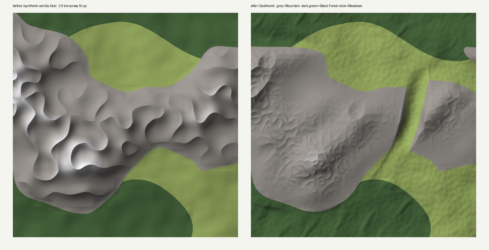

# Scotheim

A BepInEx mod for Valheim that reshapes Meadows, Black Forest and Mountains to look like the Scottish Highlands.


*Preview of the transform on a synthetic, vanilla-like base field (6 km across, north up). This is not a real seed; see [Status](#status).*

## What it does

| Highland landform | How it's made | Where |
|---|---|---|
| **Glens** (glacial U-troughs) | Carved into the game's *base height*, trending NE–SW (Caledonian grain, ~040°). Cross-profile follows a power law z ∝ \|x\|^b, b = 2 by default. | Everywhere within 7 km of centre |
| **Ribbon lochs** | Overdeepened stretches of glen floor pushed below sea level | Deep glens only |
| **Munros** | Rounded domes on a lifted massif, summits soft-capped with tanh. Vanilla's jagged mountain relief is discarded. | Mountain |
| **Corries** | Bowls cut into the NE flank of about half the summits, open downslope | Mountain |
| **Moorland** | Broad rolling relief, hummocks, lochans on low ground; broadleaf trees thinned | Meadows |
| **Drumlins, Caledonian pine** | Elongated hills aligned with the grain; spruce thinned, Scots pine increased | Black Forest |

The key design choice is carving glens into `GetBaseHeight`. That is the field Valheim uses to choose biomes (base altitude > 50 m means Mountain). So a glen floor stops being Mountain and becomes Meadows or Black Forest, whichever the distance ring gives. You get bare, cold hills with habitable, wooded glens between them, and biome assignment, rivers and the minimap all stay consistent with the terrain.



## Costs and caveats

- **New worlds only.** Valheim regenerates terrain from the seed, but saves objects in zones you've visited. On an existing world, explored areas get floating or buried trees and buildings.
- **Every player and the server need the mod with identical terrain settings.** Each peer generates its own ground. The log prints a `Terrain signature` hash that players can compare.
- **Less Mountain biome.** On synthetic terrain the defaults cut Mountain area by about 25% (17→13%, 27.5→20.5%, 27→20% across three seeds). That means less silver and fewer wolves, and Moder's altar competes for less space. To trade it back, raise `Glens.Spacing` or lower `Glens.HalfWidth`.
- **Lower hills.** Summits cap at ~140–160 m above sea instead of vanilla's taller spikes. Real munros are low and rounded relative to their spacing, but in game this reads as "smaller mountains".
- **One water plane.** Valheim has a single sea level at y = 30, so every loch sits at sea level. There are no lochans in corries or on high moor.
- **Glen floors never drop below 20 m.** Anything lower in the 2–6 km ring risks turning into Swamp. Lochs are cut into the final height, not the biome height, to get around that.
- **Mod compatibility.** Scotheim reads the *unpatched* `GetBaseHeight` via a Harmony reverse patch. Mods that postfix it (e.g. Expand World Size's altitude settings) are ignored in that read. Mods that replace biome heights (Expand World Data, Better Continents) will probably fight with it.
- **Wall steepness.** Glen width uses a first-order distance estimate that runs ~0.6–0.8× the configured `HalfWidth`. Big glens reach 35–40°. About 0.1–0.4% of land exceeds 40° in the previews, versus ~0.02% on the synthetic "vanilla" (real vanilla mountains are steeper than my stand-in).

## Status

**Not yet run in the game.** What has been verified:

- The terrain math runs offline through `tools/Preview`, on the same source files the plugin compiles, over a synthetic base field. The previews and all the numbers above come from there.
- The Harmony patches have been run for real (HarmonyX 2.10 under Mono) against stub Valheim types that mirror the real method shapes (`tests/Harness`). That covers patch targets, positional argument binding, the reverse patch, menu/Plains passthrough, thread-safety of parallel evaluation, and non-compounding vegetation scaling.
- Method and field names (`GetBaseHeight`, `GetBiomeHeight`, `m_world`, `ZoneSystem.m_vegetation`, …) were checked against current open-source world-gen mods, not against the game assembly, which I didn't have.

Still unverified: that the plugin builds against the real `assembly_valheim.dll`; how the terrain looks with Valheim's actual base field; performance; and the vegetation prefab names. The plugin logs any rule that matches nothing.

## Build and install

1. Install BepInEx 5 for Valheim (BepInExPack_Valheim).
2. `dotnet build src/Scotheim -c Release -p:ValheimDir="<path to Valheim>"`
3. Copy `src/Scotheim/bin/Release/netstandard2.1/Scotheim.dll` to `<Valheim>/BepInEx/plugins/`.
4. Start the game once to generate `BepInEx/config/cavmkii.scotheim.cfg`, then create a new world.

## Tuning

The config is grouped into Glens, Mountains, Moorland and Forest; every entry has a description. To see an effect before loading the game:

```sh
mcs -out:preview.exe tools/Preview/Preview.cs src/Scotheim/Terrain/*.cs
mono preview.exe out 12345 6000 900          # dir, seed, window size (m), pixels
python3 tools/Preview/render.py out          # -> out/preview.png (needs numpy, Pillow)
```

The preview uses `HighlandsSettings` defaults, so edit those to try values there.
